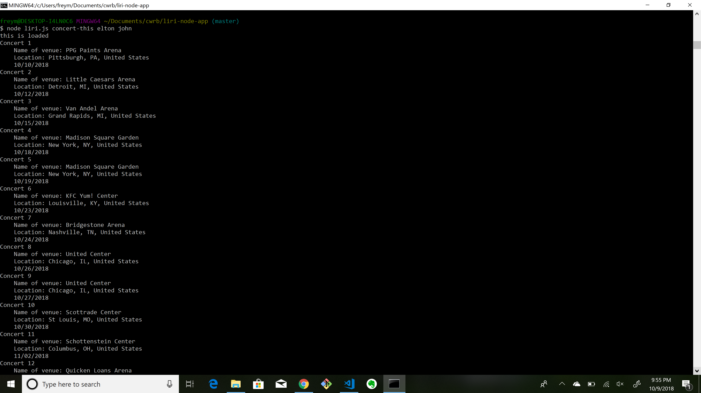
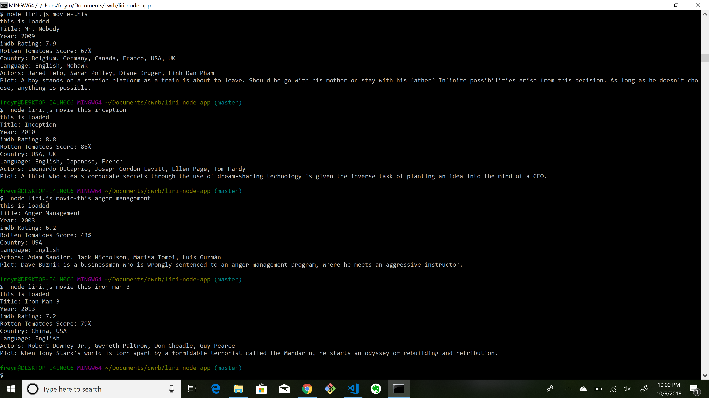
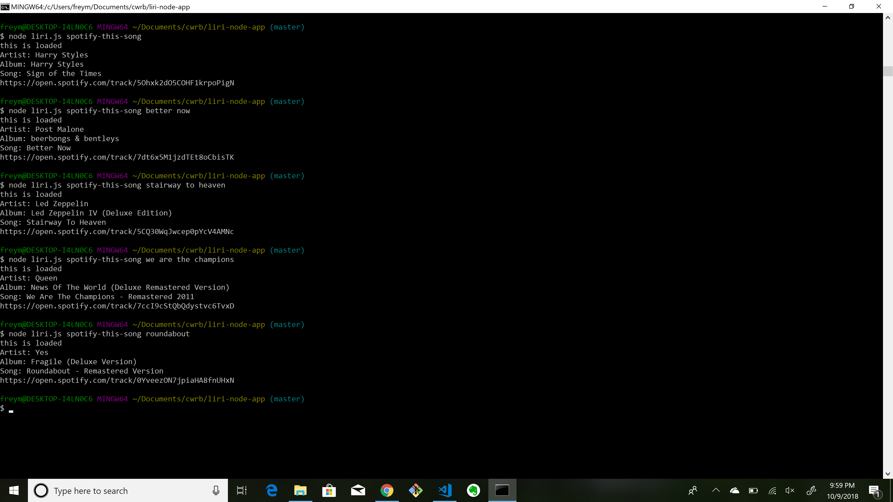
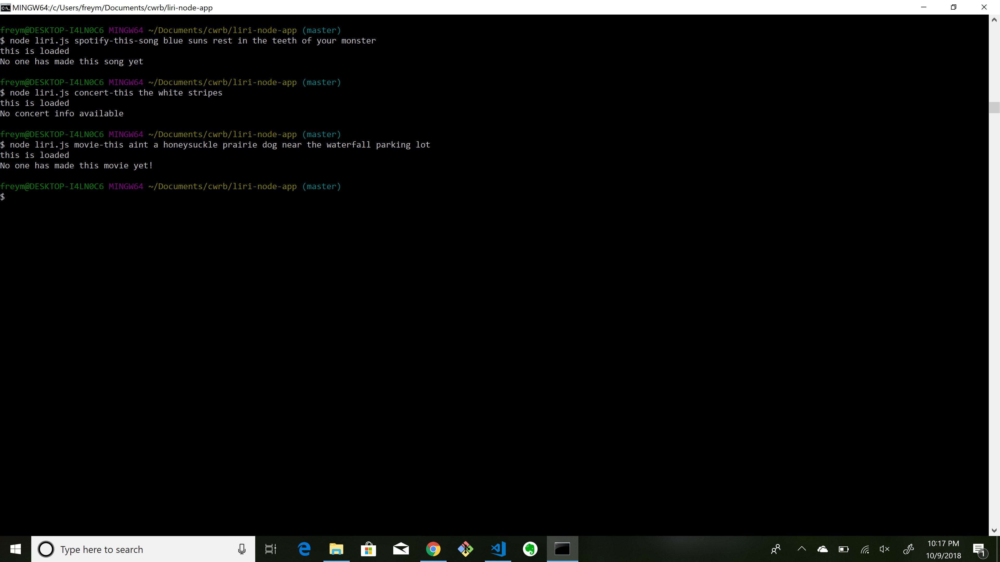
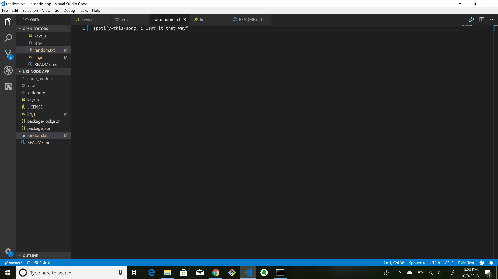
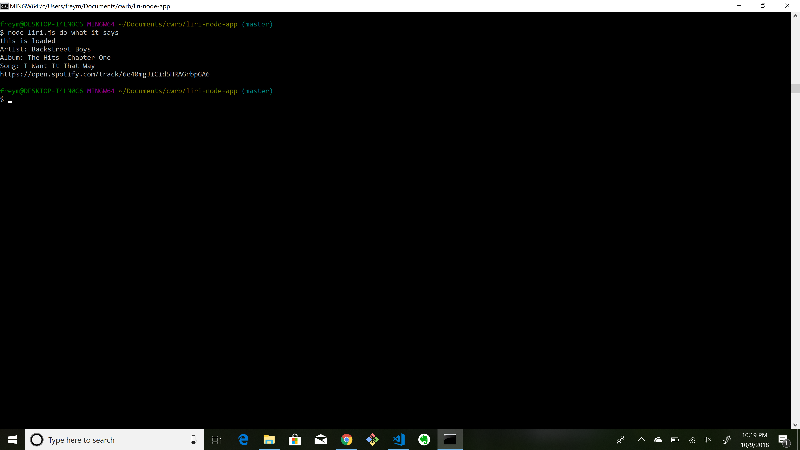

# liri-node-app

This is a command line application. 

It features heavily the use of 
packages, functions and API's such as require, fs, moment, spotify, omdb, and bandsintown.

The main function is to take user input, or input from a file, and retrieve information from three different API's and displaying information clearly for a user.

Some problems encountered and solved: 
Different criteria for urls used to request information from API's.
Differently returned responses from API's and finding where to get the information.

this shows the ouput of the concert function

this shows the ouput of the movie function

this shows the ouput of the song function

this shows the handling of some bad possible inputs for each function

the random file the program can read from

and it working
